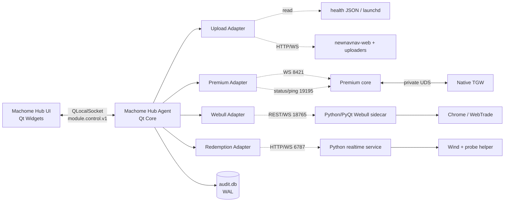

# 02 总体架构与多线程设计

## 1. 架构决策

四合一只合并**观察、控制和页面入口**，不合并故障域。采用两个新进程：

- `machome-hub-ui`：Qt 6 Widgets/C++20；只负责页面、模型和用户交互，可以随时退出。
- `machome-hub-agent`：Qt Core/C++20；launchd 常驻；负责只读探针、受控命令、状态归一化、审计和唯一监管 lease。

四个业务模块继续独立运行。Python/PyQt 不嵌入 C++ Qt 进程；Webull Chrome/Playwright、Wind/LLDB、TGW SDK 和 Go/Python uploader 均保持进程隔离。



## 2. 所有权规则

每个可管理进程组必须只有一个生命周期 owner：

| 阶段 | Owner | Hub 行为 |
|---|---|---|
| Shadow | 现有 launchd / 旧 A-console / 旧 PyQt app | 只读；控制按钮禁用；可打开/聚焦旧窗口 |
| Control pilot | 仍由原 owner 托管 | 只调用已有**逻辑控制**，如 Webull collector mode；不 kill PID |
| Owner cutover | hub-agent 或 launchd 二选一 | 在维护窗口交接 lease；精确 label/进程组；保留旧配置回滚 |
| UI 内嵌 | 后台 owner 不变 | 只替换界面，不改变业务进程生命周期 |

禁止：

- UI 用模糊 `pkill`/进程名控制；
- QProcess 和 launchd 同时认为自己是父级；
- hub-agent 和 A-console 同时拉起 premium core/TGW；
- 仅凭端口占用就“附着”未知服务；必须校验协议、module ID 和 instance ID；
- UI 退出时顺带停止后台模块。

## 3. 线程与执行器模型

### 3.1 Hub UI

```text
GUI 主线程
  ├── QAbstractItemModel / 页面渲染
  ├── 导航与非模态二级窗口
  └── 只处理不可变 ModuleSnapshot

Hub IPC QThread
  ├── QLocalSocket
  ├── frame 解码 / schema 校验
  └── 重连与心跳

可选解析 QThreadPool
  └── 大历史文件、CSV 导出、复杂 JSON；任务有上限和取消令牌
```

GUI 线程绝不做：SSH、HTTP 等待、WS reconnect sleep、进程 wait、全量日志读取、磁盘遍历、历史文件解析或大表 `ResizeToContents`。

### 3.2 Hub Agent

```text
Agent 主事件线程
  ├── QLocalServer
  ├── 状态仓库（只接收快照）
  └── 命令路由（不执行阻塞动作）

UploadAdapter QThread       WebullAdapter QThread
PremiumAdapter QThread      RedemptionAdapter QThread
  ├── 本模块 timer/network/file watcher
  ├── 本模块 health reducer
  └── 本模块串行 command lane

ProcessControl QThreadPool（最多 2）
  └── launchctl/query/有界 wait；每任务 deadline

AuditWriter QThread
  └── SQLite WAL / 批量写 / 敏感字段清洗
```

四个 adapter 各有独立 event loop、超时、熔断和状态序列号。一个 adapter 卡住不得占用另一个 adapter 的线程。模块内部控制命令按序执行，不同模块可并行。

### 3.3 业务进程内的隔离保留

- upload：Go 多 goroutine不改；同步 Python uploader 保持独立进程。未来把网络、IB 和持久化拆成有界 worker，但不是首期前置条件。
- premium：保留 core 的 4 个计算分片、持久化线程、PushPlus 线程以及 TGW 独立 SDK 线程。
- Webull：保留 browser collector thread、aiohttp API thread；未来持久化改为单消费者有界队列，不在 response lock 内等待磁盘。
- 实时申赎：首期保留 Python/FastAPI；后续将 Wind 探针独立成可杀 helper，避免被 TCC/LLDB 卡死的线程耗尽默认 executor。

## 4. 状态模型

不能用一个红绿灯表达全部状态。每个模块快照至少包含四个正交维度：

1. `lifecycle`：`unknown | starting | running | stopping | stopped | failed`
2. `work_state`：`active | scheduled_idle | paused | warming | degraded | blocked`
3. `desired_state`：用户或调度希望的状态
4. `health`：process/control/upstream/data/downstream/storage 五个 component

推荐归一化状态：

| 显示 | 条件示例 |
|---|---|
| 正常运行 | 进程、协议、上游与数据新鲜度均满足当前时段 |
| 计划空闲 | 进程与控制面健康；当前时段明确不要求数据 |
| 预热 | 计划即将开始；上游/订阅尚未 ready，仍在规定 deadline 内 |
| 已暂停 | 用户逻辑暂停，服务/控制面仍在线 |
| 降级 | 服务可用但一个非核心 component 异常，如历史落盘或通知失败 |
| 故障 | 当前时段应运行但核心进程/协议/upstream/data deadline 失败 |
| 未知 | 探针过期、协议身份不匹配或状态无法证明 |

### 4.1 时段感知

- Webull 09:00–16:00 之外 browser stopped + data no_data 是正常 `scheduled_idle`。
- premium 盘外 `quotes_desired=false`、TGW session closed 是正常 `scheduled_idle`。
- 实时申赎 15:00 后 Wind stopped 是正常 `scheduled_idle`。
- upload 网站常驻，但各 uploader、日终任务、历史任务有各自时段；总卡片必须显示子任务矩阵。

交易日历当前多处只是周一至周五。首期应忠实呈现现状并明确 `calendar_source=weekday_only`；节假日能力单独立项，不能在迁移中暗改业务行为。

## 5. 状态采样与背压

### 5.1 采样源优先级

1. 模块自报的版本化 status/health；
2. 业务数据时间戳与序列号；
3. launchd 精确 label 与进程参数；
4. 文件 mtime/原子 health JSON；
5. 日志仅作为补充，不作为唯一健康源。

状态更新使用 latest-only 合并：同一模块 UI 待消费快照最多 1 个；新快照覆盖旧快照并累加 `coalesced_count`。控制结果、报警和审计事件不得丢弃。

### 5.2 建议节奏

| 数据 | 频率 | 规则 |
|---|---:|---|
| 进程/launchd | 2–5 秒 | agent 缓存；不要每个 UI 刷新都 spawn 命令 |
| 模块 status | 1 秒或协议推送 | 失败指数退避 1/2/5/10/30 秒 |
| 首页渲染 | 250–500 ms 合并 | 只更新变化字段 |
| 日志 | 游标增量，250 ms–1 秒批量 | 每模块内存 ring；禁止全文件重读 |
| 磁盘/版本 | 30–60 秒或文件变化 | hash 只在版本/mtime 变化时计算 |

每个 network probe 必须有连接/首字节/总 deadline；取消只影响本模块。连续失败触发 circuit breaker，后台低频试探，用户手动重试可触发一次受控探测。

## 6. 命令模型

生命周期和业务模式分开：

- `start_service` / `stop_service` / `restart_service`：影响进程，属于高风险；二次确认。
- `resume_work` / `pause_work` / `set_auto`：服务保持在线，优先使用。
- `refresh` / `reconnect_upstream` / `restart_browser` / `open_legacy_ui`：模块能力；`open_legacy_ui` 仅限未接管的 shadow/logic 兼容阶段，owner 禁用（旧 UI 会拉起旧 supervisor）。

每个命令具备：

- `command_id` 幂等；
- `expected_revision` 乐观并发控制；
- `accepted → running → succeeded|failed|timed_out` 状态；
- preflight、影响范围、deadline、最终状态验证；
- 用户、时间、理由、前后快照、脱敏输出的审计；
- 同模块串行，不同模块并行；
- UI 超时不等于后台动作取消，必须能按 `command_id` 追踪最终结果。

不提供“任意 shell 命令”能力。“停止全部”默认不出现；如未来需要，只在显式维护模式下逐模块有序执行并显示依赖影响。

## 7. 启停依赖

### 7.1 Premium

```text
启动：core → 8421/19195 ready → TGW → login → subscribe → business ready
停止：拒绝新控制 → TGW退订/退出 → core flush/退出
恢复：core 异常按 core+TGW 整组恢复
```

不能只重启 core；生产记录曾出现 TGW 未主动恢复 bridge。

### 7.2 Realtime redemption

```text
服务 ready → Wind启动/ready → probe加载 → warmup → 批量订阅 → monitoring
停止：批量停订 → 温和关闭 Wind → 确认进程退出 → 清理指定探针文件
```

禁止自动 SIGKILL；Wind 未确认退出时禁止清 dylib。

### 7.3 Webull

服务/API 常驻，collector 按 auto/force 模式独立启停。首期“停止”默认表示 `force_stopped`，不停止 API sidecar；服务级 restart 需二次确认并交给唯一 owner。

### 7.4 Upload

网站和每个 uploader 独立控制。某个 uploader 失败不应重启网站或整个组。涉及持续上传的进程，在 stop 前先确认没有进行中的批次/反向请求，并保存最后 health state。

## 8. 数据与配置位置

首期不搬生产数据。Hub 自身只写：

```text
~/Library/Application Support/MachomeHub/
  config/modules.json          # 不含密钥
  state/audit.db               # SQLite WAL
  logs/hub-agent.jsonl
  logs/hub-ui.log
  cache/build-manifests/
```

业务模块继续使用原路径。若后续搬迁，必须单模块、复制校验、双读 shadow、切换、保留原目录回滚；不允许统一应用首次启动时自动搬数据。

## 9. 可用性目标（设计门槛）

- UI 主线程不得因任一外部操作阻塞超过 100 ms；压力测试 p95 事件处理小于 50 ms。
- 某模块停止响应时，其他三模块状态在 2 秒内仍可刷新、页面仍可操作。
- 控制命令本地 ACK 目标 500 ms 内；长动作异步追踪。
- 每个状态/日志队列有上限，满时有 drop/coalesce 计数；控制与告警队列不丢。
- UI 崩溃或退出不影响四个后台模块。
- agent 崩溃时，当前 owner 为 launchd/旧监管器的模块不受影响；owner 已交接的模块由 launchd 重启 agent 后恢复 lease 与状态。
