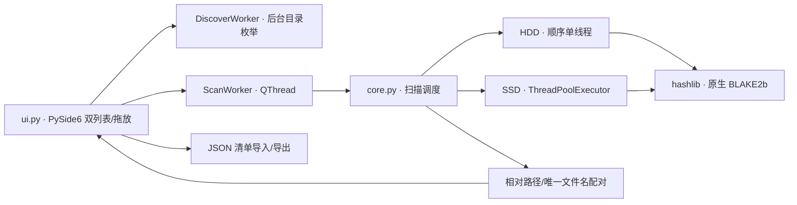

# 技术设计

## 为什么采用 PySide6，而不单独写 C++ 扩展

本项目的瓶颈主要是磁盘吞吐而非摘要算法。Python 层只负责调度、读块和更新 UI；每个 4 MiB 读块交由 `hashlib.blake2b()` 的 CPython 原生编译实现计算，而且足够大的 `update()` 会释放 GIL。因此 SSD 模式可用线程并发读取/哈希，不存在逐字节 Python 运算或额外 C++/Python 数据复制。

为这项用途再维护一个自定义 C++ 扩展会提高 Windows/macOS 双平台的编译、签名和打包成本，但不会显著提高端到端扫描速度。BLAKE2b-256 是标准库稳定提供的 256 位摘要：比为安全对抗场景设计的 SHA-256 更适合作为默认归档完整性检查。仍保留 SHA-256 选项，方便与其它工具互通。

若后续实测在高速 NVMe 阵列上 CPU 成为瓶颈，可在 `core.py` 的 `_new_hasher()` 增加可选 `blake3` 后端；该包提供原生代码轮子，界面和清单格式不需要改动。

## 模块边界

## 核验状态

| 状态 | 两侧处理 | 含义 |
| --- | --- | --- |
| 绿色 | 两侧同色 | 文件名（或相对路径）、大小、算法和哈希一致 |
| 黄色 | 两侧同色 | 已成功配对，但大小、哈希或算法不同；也包括读取错误 |
| 灰色 | 单侧或两侧 | 找不到安全配对项、存在重复名歧义，或仍在等待扫描 |

清单保存时会移除本机绝对路径，保留相对路径、大小、时间、算法和摘要。载入清单后可以直接作为左侧的可信基准；右侧只需加载重新下载的文件并扫描。
