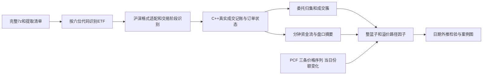

> 实现状态（2026-09-12）：C++核心、pybind11、CLI和14:30/14:45文件批量入口已实现并测试。构建与边界见 [native/README.md](native/README.md)，首次预测检验见 [研究报告](study/L2方向与数量回测报告.md)。QMT网络接入按用户要求暂缓；不把撮合识别或母单匹配当成已确认的一级申赎。

# 港股通ETF：L2识别与C++撮合方案

版本：2026-09-12。当前工作范围为2026年已完成下载的数据；2025年不再回补。本文件是实现设计，不是已经完成的C++回测或性能报告。

## 1. 实现选择

采用 **C++20核心 + pybind11 + 独立命令行**。核心库不依赖Python或Qt。

- C++：CSV数值解析、沪深事件适配、订单状态、真实成交归集、盘口数量更新、连续成交簇、分钟累计、质量检查。
- Python：PCF与汇率、1navs份额标签、模型训练和日期验证、图表、报告。
- pybind11一次提交一个基金日或一个大批次，计算期间释放GIL；不逐笔调用Python，也不逐笔回调。
- 同一核心可以编译为macOS库和Windows DLL；Python模块分别是`.so`/`.pyd`。第一版只做pybind11接口，未来需要兼容现有ctypes再增加稳定C ABI。
- 单个基金日顺序计算，不同基金日并行。先以2—4个工作线程测试外置硬盘吞吐，按内存预算限流。



## 2. 源文件识别：先修正证券身份

当前供应商文件名和CSV中的“万得代码”可能把上海ETF写成`.SZ`，两处相同不代表正确。

识别顺序：

1. 用网站目标列表及PCF建立`六位代码 → 正确市场`映射；在本研究ETF范围，5开头映射上海，159开头映射深圳。
2. 原始后缀只保留为来源信息，不参与目标筛选。无法在目标映射中找到的证券不进入本研究。
3. 归一化目录名为`513330.SH`等；原始名称写入manifest，CSV原文件不篡改。
4. 每天分别报告沪深目标数、存在PCF的目标数、缺文件列表、后缀修正数。
5. 同一个规范代码对应两份不同内容时立即隔离，不静默覆盖。
6. 压缩包可有日期目录，也可直接从证券目录开始；已发现2026包省略日期层，必须按规范识别，不能硬编码目录深度。

2026提取脚本已改为按六位代码筛选，并核验两市覆盖。原7z暂时保留。此前后缀错误及已删除日期的记录保留在`suffix_incident.json`；用户已要求2025年不回补。

## 3. 已核对的字段及编码

样本编码GB18030，价格整数除以10000，数量为份。生产适配器对每种表头建立版本和列位置映射；C++读取数值列不必把每一行转换为Unicode。

| 内容 | 原始字段 | 处理 |
|---|---|---|
| 日期、时间 | 自然日、时间 | 校验日期；HHMMSSmmm转当天毫秒。接口用微秒容器，但保留源精度为1毫秒 |
| 成交唯一标识 | 成交编号 | 保留来源行号；检测重复与倒序 |
| 双边委托引用 | 叫买序号、叫卖序号 | 构建买卖订单关联，不把单笔成交数量当原始委托数量 |
| 委托标识 | 交易所委托号 | 本样本“委托编号”大量为0，不能用它作为订单键或公共事件序号 |
| 成交方向 | BS标志 B/S | 连续竞价阶段使用供应商方向；用委托关系与盘口抽样复核 |
| 深圳撤单 | 成交代码 C | 从成交表拆出撤单，不能计入成交额；成交代码0为真实成交 |
| 上海订单 | 委托类型 A/D/S | A为新增挂单，D为删除，S等状态事件单独处理 |
| 上海成交 | 成交代码空、价格及数量有效 | 作为真实成交，不按空代码丢弃 |
| 占位记录 | 自然日0、空标志等 | 单独计数，不当正常事件 |

订单键为`交易日+规范证券+市场+通道+订单号`。没有通道字段时，记录`channel_unknown`并验证单证券日订单号是否冲突；冲突时不能凭订单号强行合并。订单消息和成交消息的序号不可直接当成同一编号空间。

## 4. 核心原则：真实成交只入账一次

本项目的“撮合”首先指**依据真实成交关联双方委托，更新订单与盘口**。不根据挂单交叉再生成一遍真实成交。

两个处理模式分开：

- `ObservedReplay`：本次历史研究采用。真实成交决定成交量和金额，委托事件补充原始数量、挂单和撤单信息。
- `Simulation`：以后研究假设挂单能否成交时才用。单独输出模拟成交，不并入历史真实成交，不用于当前净申赎标签。

同一真实成交只计一次市场成交额，同时关联买方和卖方订单。买卖双方成交数量分别累计用于各自生命周期，但二者之和不能再作为市场总成交量。

## 5. 深圳订单状态

新增委托记录提供申报数量；以真实成交中的双边委托号分摊成交，以C记录扣减撤单。

守恒关系：

`原始申报量 = 已成交量 + 已撤量 + 剩余量`

订单状态：`已申报 → 部分成交 → 全部成交/部分撤单/全部撤单/收盘剩余`。

市价委托价格可能为0或有特殊类型，仍按真实成交价格记账；不能把0价格挂到普通价位中，也不凭委托价格计算实际成交额。逐笔引用尚未出现的订单先挂待关联标记；日终仍不能关联则报告质量异常。

## 6. 上海订单状态：即时成交与挂单余量分开

上海适配器为每个订单分别维护：

- 初始主动成交量；
- 首次A消息报告的挂单余量；
- 挂单后的被动成交量；
- 撤单量、剩余挂单量；
- 原始申报量是否可知、推导依据和可用时间。

### 6.1 部分即时成交后挂单

例：一个卖单实际100万份，先主动成交60万份，余下40万份进入委托表；随后被动成交25万份、撤掉15万份。

应还原为：

`原始100万 = 初始主动60万 + A挂单余量40万`

`原始100万 = 全部成交85万 + 撤单15万 + 剩余0`

A消息到达时只把40万加入盘口，**不能再从这40万中扣一次此前的主动成交60万**。每笔主动成交的数量是当笔实际成交数量，不能视作整个主动委托量。

初始主动成交的认定依靠同一订单号、连续竞价阶段、主动方向，以及与首次挂单时间的因果关系。存在无法解释的时间矛盾时标记不确定，不为了守恒强行补量。

### 6.2 完全即时成交、没有A消息

可以汇总同一主动订单号的已成交数量，但通常无法仅凭缺少A消息断言其完整原始申报量：例如未知市价/即时成交剩余撤销指令可能有未观察的剩余部分。

输出`已观察成交量`和`original_quantity_known=false`。此类订单能参与成交型篮子因子，不能冒充“原始申报量恰好一篮子”。

### 6.3 集合竞价

集合竞价中的BS字段不用于推断主动资金，也不用于给A数量补上所谓初始主动成交。集合竞价成交仍计入全日成交和双方生命周期，阶段单独标记。

### 6.4 本地样本校验

为核对字段语义，检查了已存在的2025-01-20两个沪市样本513330、513090及一个深圳样本159570，未新增回补2025数据。

沪市直接以A数量作为完整订单量会出现超额成交；按初始主动成交加挂单余量还原后，以上两个沪市样本的“成交+撤单超过推导原始量”数量均降为0，无法解释的被动成交占比为0，逐笔总成交量与行情累计量比值为1。仅作为适配机制的样本证据。随后已在2026-01-05的513330.SH、513090.SH和159636.SZ进行同类核对：三者逐笔成交量与行情累计量一致，未出现数量超额或无法解释的被动成交；详细数字见`design_validation_2026.json`。这仍是Python参考核对，不是C++实现验收或因子有效性验证。

## 7. 同毫秒顺序与交易阶段

原始表没有可靠的跨表总序号，时间戳相同不等于能确定所有事件的先后。不能简单规定所有A先处理或所有成交先处理。

设计采用：

1. 各源内部保留序号与原始行号；
2. 同毫秒形成事件批；
3. 根据已知被动订单必须先存在、主动即时成交先于其余量挂单等关系构建局部依赖；
4. 无冲突时按依赖处理；无关事件的相对次序保持未知；
5. 依赖矛盾、缺失公共序号时输出批结束盘口和歧义标记，不声称恢复了精确微秒队列；
6. 用行情快照对账。快照差额不会被静默当成新增真实委托或成交。

对只需要成交归集、资金流和分钟统计的因子，不强求完整价格队列重建。第一阶段优先完成这些稳定的输出；完整逐价队列作为第二层功能。

交易阶段按`市场+证券类型+规则生效日期`配置，不能直接套A股股票时间表。

- 当前2026年1月：上海ETF连续交易需覆盖14:57—15:00，深圳收盘集合竞价单列。
- 9:25开盘集合成交、深圳15:00收盘集合成交纳入全日成交校验，但从主动方向特征分离。
- 11:30—13:00不跨午休构造连续成交簇；15:00—16:00不参与A股ETF溢价和资金流统计。
- 三条价格序列保留全部有效A股交易分钟；已结束分钟再与同分钟L2汇总关联。15:00后的港股行情仅可用于单独结算情景。
- 2026年后续规则存在修订，扩展日期时必须核对具体生效及暂缓条款，不能把1月时段规则推广到全年。

## 8. “凑成一篮子”分三层，证据强度不同

### A. 同一交易所委托号：最明确

汇总同一订单的完整成交量、主动成交量、被动成交量；原始量已知时再计算申报量。分别计算原始量和已成交量是否接近当日PCF单位U的整数倍。

`距离 = min(k>=1) |数量-kU| / U`

保留精确匹配、±100份、±0.1%、±0.5%、±1%等原始距离，不先选最有利阈值。部分成交及原始量未知的订单单独统计。这里叫“交易所订单归集”，不能把它当成识别了投资者整个算法母单。

### B. 邻近同方向成交簇：中等证据

按自然停顿和方向变化先分段，再计算段内成交量是否接近U；不先知道U再任意截取成交来凑整数。

初始候选：同方向，间隔不超过100ms/500ms/1s；价格变动不超过0/1/2档；不跨午休和集合竞价。固定参数小网格在训练阶段选择，并报告跨度、订单数、成交数。分别保留逐笔簇和按主动订单归集后的簇，避免拆单方式主导结果。

### C. 多订单组合与挂单补充：较弱证据

识别同价位卖单持续成交后迅速补量、买盘持续消耗但溢价压回、多个大卖单集中完成等模式。它们是供给/吸收的行为代理，不证明是同一账户，也不反推出实际申购总量。

### 必须设置的对照

- 真实PCF单位与0.8U、1.2U、1.3U等安慰剂单位比较；同时保持100份整数习惯。
- 在基金/日期间置换篮子单位，控制常见50万、100万整数大单效应。
- 打乱成交间隔或方向，但尽量保留单笔大小与日内活跃程度，检验簇结构的额外信息。
- 真实单位命中率与随机/整数大单基准的差值，才作为更值得研究的特征。

这些对照只能减少误判，不能把匿名二级市场成交转换成真实一级市场申赎指令。

## 9. 因子优先级：观察需求、供给和价格反应

| 因子族 | 具体量 | 需要验证的解释 |
|---|---|---|
| 主动方向 | 主买/主卖金额、净额、占比、占历史成交额与流通份额比 | 买盘需求是否推动套利商补充供给 |
| 大委托供给 | 大卖方订单成交份额、被动卖出吸收、集中度 | 新申购份额卖出也可能表现为被动卖，不能只看主卖 |
| 整篮子成交 | 同单和短簇的单位匹配、净卖方单位匹配超额 | 是否比普通整数大单更能解释净申购 |
| 溢价被吸收 | 溢价升高后买盘仍在，但溢价下降、卖方成交增加 | 与供给进入一致的候选模式，未必由申购造成 |
| 折价买入 | 折价持续期间的大买方订单及其篮子匹配 | 可能与买入再赎回需求有关 |
| 补单与撤单 | 固定价位补量速度、成交/撤单比、订单存续时间 | 区分成交供给与只挂不成交的报价行为 |
| 全天结构 | 持续时间、金额加权强度、前后阶段变化、事件频次 | 全分钟路径特征，避免仅挑单独观察时点 |

“主动资金流”准确含义是按主动方向统计的成交额差。每笔交易都有买卖双方，不能将这个差额解释成整个ETF实际现金流入，更不能将其直接等同于净申购。

最值得先验证的组合是：**溢价出现 → 买盘持续 → 大卖方订单成交/补充 → 溢价被压回**。还要寻找反例：相同形态最终净赎回、份额不变的日期，比较其差异。

## 10. 验证方案与目标

标签沿用用户确认的口径：1navs T日份额减上一实际交易日份额就是T日净申赎，不平移一天。假日重复填充行仅在份额不变且变化为0时跳过；缺前序可核验份额则排除。

第一层输出三类概率：净申购、份额不变、净赎回。再计算净申购篮子数和占前日份额百分比；“大规模”同时看两者。

同一批合格样本比较：

1. 仅IOPV溢价路径、历史份额及成交活跃度；
2. 仅L2；
3. 原有因子加主动方向；
4. 再加订单和整篮子因子；
5. 再加溢价吸收与补单因子。

沪深先分别统计，再考虑合并模型及市场交互项，防止模型只是利用数据格式差异。按日期依次训练、验证、测试，禁止随机拆分同一天基金；按日期整体重抽样计算不确定性，另外查看同类指数基金聚集的影响。

90%是希望检验的目标，不预设结果。报告达到阈值时的信号数、交易日数、基金数、覆盖率、负向尾部和置信区间。净申购识别准确率与轧差交易实际盈利胜率分别报告；后者仍需费用、实际退补价或明确结算情景。

用户当前要求使用最终日汇率及全日路径，因此本轮结果是事后关联和日期外推，不称为盘中可执行信号。将来做实时应用时，原始量确认时间、PCF可用时间、分钟结束时间和汇率可用时间都要另加限制。

## 11. 性能和落盘设计

- 数值使用整数：价格1/10000元、数量为份、时间为整数。金额累加使用有溢出检查的整数；转换成展示金额时再除缩放。
- C++批量解析CSV，列映射由经过校验的格式配置提供；不把每笔事件变成Python字典。
- 每基金日用预分配连续数组保存订单，哈希表映射`订单号→数组索引`；价格层只有在需要盘口特征时启用。
- 处理分为订单索引、成交归集、因果事件回放三步；没有公共事件序号的文件不会伪装为已经全序排序。
- 仅输出分钟表、日因子、订单摘要和审计结果。完整逐笔解释结果可按案例请求生成，避免默认把所有中间表写回磁盘。
- 优先压缩保存基金日摘要为Parquet。缓存键包括输入CRC、证券映射、适配器版本、会话规则、PCF单位和因子配置。
- 完成一个日期写原子检查点，下载新增日期可以增量运行；中途失败不覆盖已完成清单。
- 基准分别计时：7z解压、CSV解析、订单处理、因子聚合、输出，以及端到端耗时和峰值内存。缓存热读和冷读分开。
- 用同一数据与Python参考实现对账；基准完成前不承诺具体加速倍数。

## 12. 接口与验收顺序

配套`native/include/engine_contract.hpp`定义C++输入/输出契约草案。拟提供：

```python
result = etf_l2.process_day(
    trade_file=...,
    order_file=...,
    quote_file=...,
    symbol="513330.SH",
    trade_date=20260105,
    schema_id="wind_csv_gb18030_v1",
    session_profile="sh_etf_2023",
    creation_unit=1_000_000,
)
# result: minutes, orders, bursts, quality, timing
```

验证顺序：

1. **身份与覆盖**：上海错误后缀、重复规范代码、正在下载文件、目录越界、CRC失败，均有明确测试。
2. **成交账本**：逐笔成交数量/金额和行情累计值核对；撤单与状态记录不混入成交；重复成交不重复入账。
3. **订单守恒**：深圳普通/市价/撤单；上海全即时、部分即时后挂单、纯被动成交、撤单、跨毫秒及同毫秒事件。
4. **阶段**：开盘集合不当主动成交、沪市ETF尾盘连续交易、深市尾盘集合、午休分段。
5. **不确定性**：缺订单、缺通道、顺序冲突、未知原始量，不强行补成确定值。
6. **因子**：成交型和原始申报型篮子命中分开；一个成交不能被重复计入多个重叠主结果簇；保留参数对照。
7. **性能**：至少各选一个沪深活跃ETF和一个低成交ETF实测；整数汇总要求精确一致，浮点派生量按明确误差界比较。
8. **外推**：足够2026日期落盘后再训练与测试；短期样本只做探索，不输出已证实90%的结论。

## 13. 现有程序复用范围与来源

已阅读`/Users/ellis/QMTAPI/盘口分析器dll`的Python与C++实现。可复用订单索引、价格层、主动订单归集、质量表设计与CMake组织方式；供应商历史CSV的上海余量语义和事件排序单独适配。

具体参照：

- `native/book_native.cpp`中的`MatchingBook`、`add_order`、`handle_reported_trade`；
- `nv8_analyzer/tape.py`中的`_restore_trade_sides`、`_annotate_order_context`、`active_order_ids`；
- `nv8_analyzer/analysis.py`中的`_parent_orders`和`_quality_and_lifecycle`。

现有QMT归档的上海成交可能只保留主动侧订单号，本批CSV保留双边引用，因此不能直接照搬旧归档字段映射。旧程序按完整日上下文再裁切的思路可用于事后研究；未来盘中模式必须按信息当时可知时间限制。

官方资料用于核对协议与交易阶段：

- [上证Level-2接口说明书](https://www.sseinfo.com/services/assortment/document/interface/c/10747483/files/a4de433d5dda438c9cafd7fa6ed15cde.pdf)
- [上交所关于基金连续竞价时段的说明](https://edu.sse.com.cn/best/audio/tjxwc/c/5331843.shtml)
- [深交所交易时段说明](https://investor.szse.cn/knowledge/t20190626_568129.html)
- [上交所2026修订通知及暂缓实施附件](https://www.sse.com.cn/lawandrules/sselawsrules2025/fund/trading/c/c_20260424_10817739.shtml)

上述官方格式不等于供应商CSV格式，最终以字段映射、逐笔与行情对账、沪深分市场测试共同验收。
